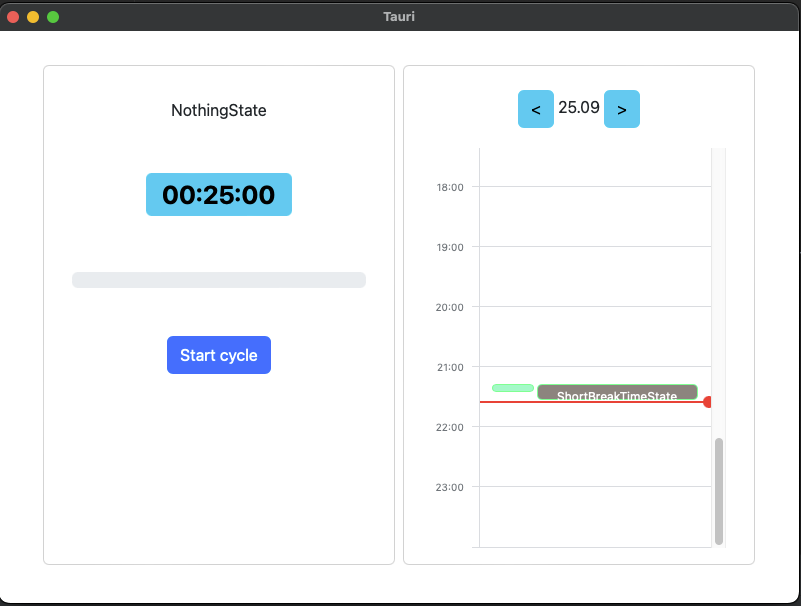
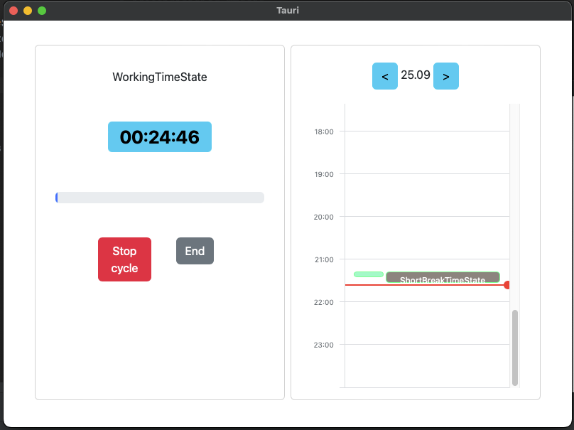

# Pomodoro App

A minimalist Pomodoro timer built with **Rust + Tauri 2.x** and **SvelteKit**.
This is very side project, I do not learn Rust to find job, only to have fun.
So please be understanding, my target is not to be the best Rust developer in the world!




## Features

- Simple Pomodoro timer with configurable work and break durations
- Works in simple pomodoro states (working, short and long breaks) but when time is over, instead of stop or go to next
  state, counter still works
- Cross-platform desktop app (macOS, Windows, Linux)
- Rust backend handling timer logic

## Future Plans

- Add statistics module to track Pomodoro sessions over time
- Add support of projects and associated tasks

## Installing & running (for developers)

To start application:

```shell
cd src-tauri
cargo tauri dev
```

### Coverage report:

```shell
cargo tarpaulin -o Html
```

### Clippy:

```shell
cargo clippy -- -D warnings
```
